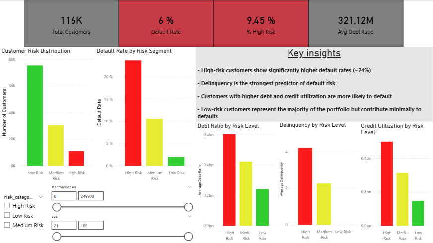

# Credit Risk Analysis
## Overview

Financial institutions face a critical challenge: how to grow their loan portfolio while minimizing the risk of default.

Poor credit risk assessment can lead to significant financial losses, while overly strict policies may reduce revenue opportunities.

This project analyzes customer financial behavior and develops a simple, interpretable credit risk scoring model to support better lending decisions.

## Objective:

The goal of this project is to:

- Assess credit risk using historical customer data
- Identify key drivers of default
- Segment customers based on risk level
- Provide actionable business recommendations

## Key Business Questions
1. *Which customers are more likely to default?*

Insight:
High-risk customers are significantly more likely to default, with a default rate of approximately 23.7%, compared to only ~2% for low-risk customers.
This demonstrates a strong separation between risk segments.

Decision:
Adopt differentiated lending strategies based on customer risk level.

Recommendations:
- Restrict approvals or apply stricter conditions for high-risk customers
- Prioritize low-risk customers for portfolio growth
- Closely monitor medium-risk customers

2. *What factors are most predictive of risk?*

Insight:
The strongest predictors of credit risk are:

- Delinquency behavior (most important factor)
- Debt-to-income ratio
- Credit utilization
- Income level

Behavioral variables are more predictive than demographic factors.

Decision:
Prioritize behavioral indicators in risk assessment models.

Recommendations:
- Implement early warning systems based on delinquency
- Set thresholds for debt-to-income ratios
- Monitor credit utilization as a risk signal

3. *How can customers be segmented?*

Insight:
Customers can be segmented into three categories:

Low Risk → financially stable
Medium Risk → moderate financial stress
High Risk → high probability of default

Decision:
Move from a one-size-fits-all approach to a segmented credit strategy.

Recommendations:
- Offer better conditions to low-risk customers
- Develop tailored products for medium-risk customers
- Limit exposure to high-risk customers

4. *What actions can reduce default rates?*

Insight:
Early identification of high-risk customers allows proactive risk management.

Decision:
Integrate risk scoring into loan approval and monitoring processes.

Recommendations:
- Adjust interest rates based on risk
- Limit loan amounts for high-risk customers
- Implement proactive delinquency monitoring
- Use data-driven approval thresholds

## Data Cleaning

- Removed irrelevant index columns
- Handled missing values:
- MonthlyIncome → median imputation (robust to outliers)
- NumberOfDependents → mode imputation
- Treated outliers using business rules and percentile filtering

## Feature Engineering

Created key variables to improve analysis:

- Debt-to-income ratio
- Income per person
- Total delinquency (aggregated delays)

## Data Analysis

Key findings:

- Default risk increases significantly with delinquency history
- Higher debt burden leads to higher risk
- High credit utilization is strongly associated with default
- Lower income customers show higher default probability

## Data Extraction (SQL)

Data was assumed to be stored in a relational database and extracted using SQL.

SELECT
    c.customer_id,
    c.age,
    c.MonthlyIncome,
    c.NumberOfDependents,
    l.loan_id,
    l.DebtRatio,
    l.RevolvingUtilizationOfUnsecuredLines,
    h.NumberOfTime30_59DaysPastDueNotWorse,
    h.NumberOfTime60_89DaysPastDueNotWorse,
    h.NumberOfTimes90DaysLate
FROM customers AS c
INNER JOIN loans AS l 
    ON c.customer_id = l.customer_id
INNER JOIN payment_history AS h 
    ON l.loan_id = h.loan_id
WHERE c.age > 18;
📈 Dashboard (Power BI)

## The dashboard provides:

- Customer risk distribution
- Default rate by risk segment
- Financial behavior comparison across segments
- Interactive filters for deeper analysis

## 📊 Dashboard Preview

## Tools Used
- Python (Pandas, NumPy) → data cleaning and analysis
- SQL → data extraction and transformation
- Power BI → data visualization and dashboarding

## Conclusion

This project demonstrates how data-driven analysis can improve credit risk assessment by:

- Identifying high-risk customers
- Understanding key risk drivers
- Enabling better decision-making through segmentation

A simple, interpretable model can already provide significant business value without the need for complex machine learning techniques.